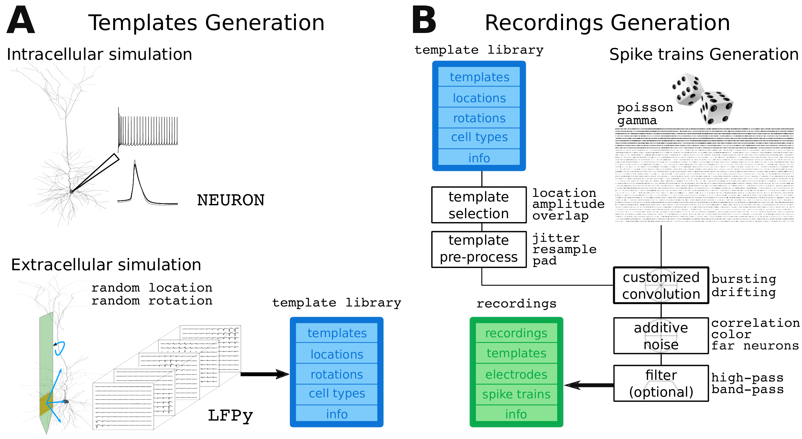

Overview
=========

MEArec is a Python package designed to make simulation of extracellular recordings easy, fast, and highly controllable.

The core idea of MEArec is explained in this figure.

The biophysical simulations of extracellular action potentials (EAP or templates) allows to generate a large number of
templates from different cell models placed at random locations and with varying rotations around the probe.
Further details and parameters of the template generation are explained :ref:`gen-templates`.

When templates are simulated, extracellular recordings can be built.
First, a set of spike trains is generated following user defined setting.
Second, templates are chosen among the available ones and they are convoluted with the spike trains with an amplitude
modulation, to ensure that the generated spike instances have physiological variability.
Finally, additive noise is added to the recordings, which can also be arbitrarily filtered.
Further details and parameters of the recordings generation are explained :ref:`gen-recordings`.

The template generation is the most computationally expensive process. Recording generation is extremely fast and all
aspects of the recordings can be finely controlled.

MEArec comes with a command-line-interface (CLI), which makes possible to use it outside of the Python environment and
it allows for scripting for generating large number of recordings.
