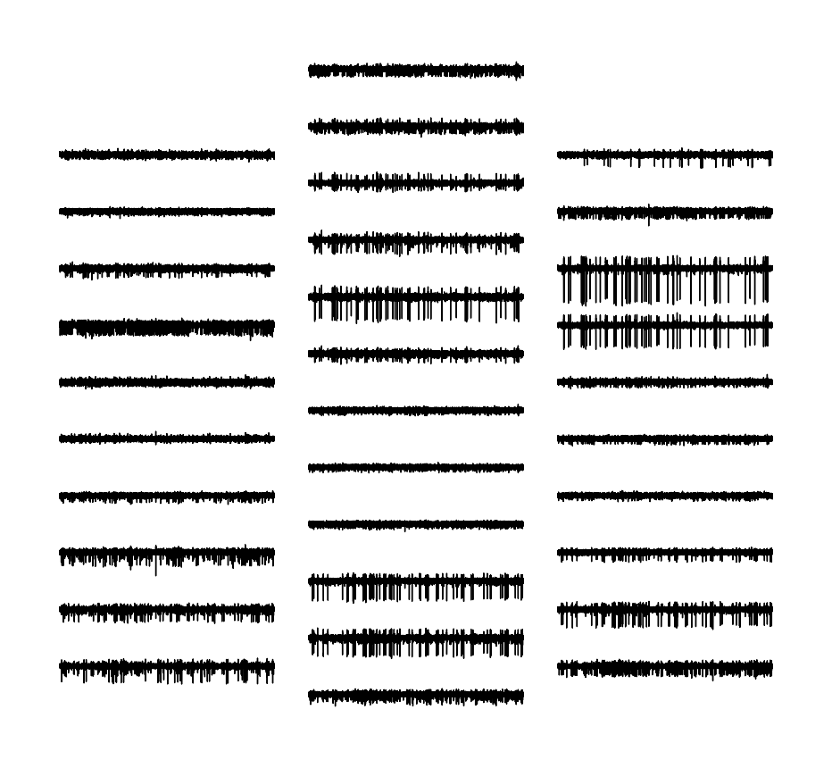
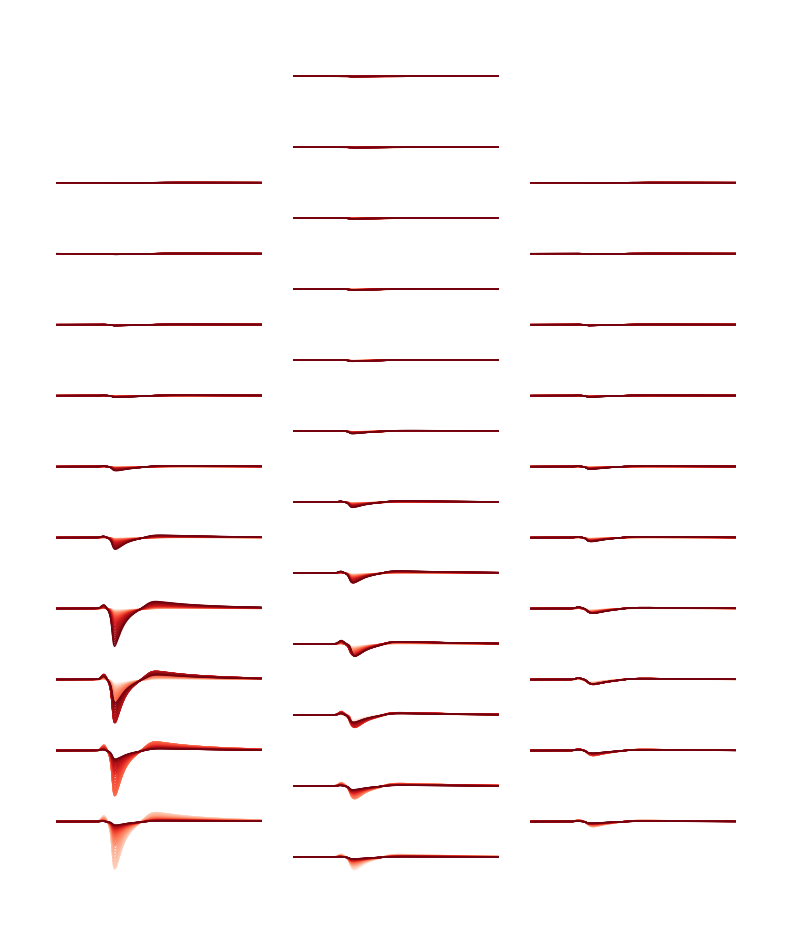

Using the generated data
========================

The generated templates and recordings can be easily loaded using the MEArec API.

.. code-block:: python

    import MEArec as mr

    # load recordings
    tempgen = mr.load_templates('path-to-templates.h5')

    # load recordings
    recgen = mr.load_recordings('path-to-recording.h5')

The :code:`tempgen` is a :code:`TemplateGenerator` objects and contains the following fields:

* templates: numpy array with (n_templates, n_electrodes, n_points) - not drifting - or (n_templates, n_drift_steps, n_electrodes, n_points) for drifting ones
* locations: (n_templates) 3D locations for the templates (for not drifting) or (n_templates, n_drift_steps) 3D locations for drifting templates.
* rotations: (n_templates) 3D rotations applied to the cell model before computing the template (for drifting templates rotation is fixed)
* celltypes: (n_templates) cell types of the generated templates
* info: dictionary with parameters used

The :code:`recgen` is a :code:`RecordingGenerator` objects and contains the following fields:

* recordings: (n_electrodes, n_samples) recordings
* spiketrains: list of (n_spiketrains) :code:`neo.Spiketrain` objects
* templates: (n_spiketrains, n_electrodes, n_templates samples) templates
* templates_celltypes: (n_spiketrains) templates cell type
* templates_locations: (n_spiketrains, 3) templates soma locations
* templates_rotations: (n_spiketrains, 3) 3d model rotations
* channel_positions: (n_electrodes, 3) electrodes 3D positions
* timestamps: (n_samples) timestamps in seconds (quantities)
* voltage_peaks: (n_spiketrains, n_electrodes) average voltage peaks on the electrodes
* spike_traces: (n_spiketrains, n_samples) clean spike trace for each spike train
* info: dictionary with parameters used

There are several notebooks available `here <https://github.com/SpikeInterface/MEArec/tree/main/notebooks>`_
that show MEArec applications.

Plotting
--------

MEArec contains several plotting routines to facilitate data inspection.
For example, a :code:`RecordingGenerator` object can be plotted as follows:

.. code-block:: python

    mr.plot_recordings(recgen)

Similarly, templates can be plotted with the :code:`plot_templates` function. This function also allows to plot drifting
templates:

.. code-block:: python

    # load drifting templates
    tempgen = mr.load_recordings('path-to-drifting-template.h5')
    # drifting templates can be plotted one at a time
    mr.plot_templates(tempgen, template_ids=100, drifting=True, cmap='Reds)

Integration with SpikeInterface
-------------------------------

MEArec is designed to help validating spike sorting algorithms. Hence, its integration
with the `SpikeInterface project <https://github.com/SpikeInterface>`_, a Python framework for spike sorting analysis,
comparison, and validation, is extremely straightforward.

After installing the `spikeinterface <https://github.com/SpikeInterface/spikeinterface>`_ package,
one can easily load a MEArec generated recording, run several spike sorting algorithms, and compare/validate their output:

.. code-block:: python

    import spikeinterface.extractors as se
    import spikeinterface.sorters as ss
    import spikeinterface.comparison as sc

    # load recordings and spiketrains with MEArecExtractors
    recording = se.MEArecRecordingExtractor('path-to-recording.h5')
    sorting_GT = se.MEArecSortingExtractor('path-to-recording.h5')

    # run spike sorting
    sorting_MS4 = ss.mountainsort4(recording)
    sorting_KS = ss.kilosort(recording)

    # compare results to ground-truth
    comp_MS = sc.compare_sorter_to_ground_truth(sorting_GT, sorting_MS4)
    comp_KS = sc.compare_sorter_to_ground_truth(sorting_GT, sorting_MS4)

    # get performance
    comp_MS.get_performance()
    comp_KS.get_performance()

More information about the SpikeInterface framework in the `docs <https://spikeinterface.readthedocs.io/en/latest/>`_
and the `manuscript <https://www.biorxiv.org/content/10.1101/796599v1>`_.

